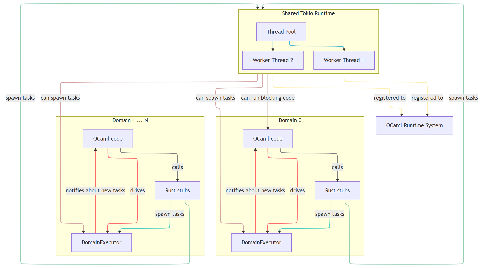

# OCaml Lwt Interop

**WARNING**: Highly experimental code, do not use in production!

This project aims to solve the problem of interop between asynchronous OCaml (Lwt flavor) and asynchronous Rust.

Documentation can be browsed [online](http://olkhovskiy.me/ocaml-lwt-interop).

## An illustrative example

The following Rust asynchronous stub:

```rust
use futures_lite::future;

#[ocaml_lwt_interop::func]
pub fn my_async_func() -> () {
    future::yield_now().await;
}
```

Can be declared from OCaml side as follows:

```ocaml
external my_async_func : unit -> unit Lwt.t = "my_async_func"
```

The `func` macro and the rest of the library do the heavy lifting to wrap that
async Rust function into Lwt promise on OCaml side.

## Architecture

### Domain Executor

The core part is the `DomainExecutor`: it is an instance of
`async_executor::Executor` that runs within an OCaml domain and is being
`tick()`ed exclusively by the OCaml domain. This ensures that access to OCaml
domain state is properly synchronized - either it's being used by OCaml code, or
OCaml code calls `tick()` of domain-specific executor instance, which then in
turn will be eligible to call back into OCaml code of the same domain.

The instance of `DomainExecutor` is managed at OCaml side, currently as a global
`ref`, as OCaml 5 support will get implemented, this would be a variable inside
Domain-Local-Storage.

Domain-local executor allows us to run Rust tasks on the same thread that is
currently Running OCaml, await other futures, spawn more tasks and so on.
 
#### Domain Executor State

Whenever tasks are polled by OCaml domain executor, we first enter domain
executor context and Tokio runtime context, both are managed as thread local
stacks. This ensures that any Tokio functions like `tokio::spawn` can safely be
used inside tasks spawned on OCaml domain executor. Also functions like getting
a reference to OCaml runtime (sentinel type from `ocaml-rs` used to synchronize
access to OCaml GC) will only work when ran on OCaml domain executor. This is a
runtime safety check, same as with `tokio`, if certain functions get called
without the context being enetered, it fails at runtime.

### Promise integration

The library comes with bi-directional promise integration. It can create OCaml
Lwt promises from Rust and resolve/reject them, and it can wrap OCaml Lwt
promises so that they are exposed to Rust as Rust futures. Nothing particularly
complex in this part, just some registered named helper callbacks from OCaml to
create Lwt promises, and connect Rust wrapper future to Lwt promise via
additional Rust stubs, used to manipulate the Rust wrapper from OCaml.

### Architecture overview diagram

With OCaml 4.x support so far, we only have Domain 0 part of the below diagram.
With OCaml 5.x support - multiple domains will run their Domain-local executors.
The only limitation is blocking OCaml code can only be run on Domain 0, which
does not sound like a big limitation in practice. The library is designed to be
somewhat future-proof to work with OCaml 5.x, but so far has not been adapted or
tested in this scenario.


