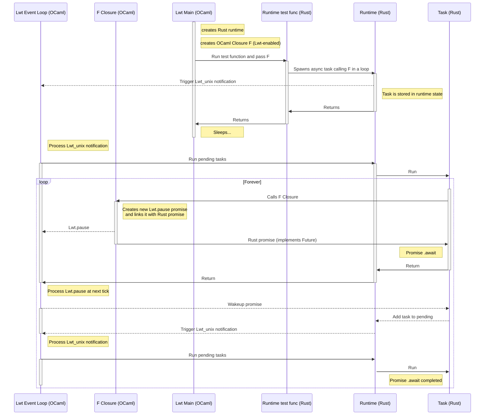

# OCaml Lwt Interop

**WARNING**: Highly experimental code, do not use in production!

This project aims to solve the problem of interop between asynchronous OCaml (Lwt flavor) and asynchronous Rust.

## Architecture

### Domain Executor

The `DomainExecutor` runs within an OCaml domain and integrates Rust async tasks with the OCaml runtime. It uses the `async_executor` crate to manage async tasks and integrates with the `tokio` runtime for asynchronous I/O operations. The executor ensures that the OCaml runtime lock is properly managed during task execution.

### Rust `Promise` and `Future` Integration

To bridge OCaml's Lwt promises with Rust's async/await syntax, the project provides a `Promise` type that implements Rust's `Future` trait. This allows Rust code to await OCaml promises asynchronously. The OCaml side can create a promise, return it to Rust, and later resolve or reject it with a value. The value is stored in the `Promise`, and when a Rust task polls this `Promise`, it will get the value back or be woken up if the value is not yet available.

## Test Scenario

The test scenario can be found in `test/test.ml`. It passes an Lwt-enabled callback into a Rust async task, which executes the callback, waits for it to complete, and then loops over calling it again.

