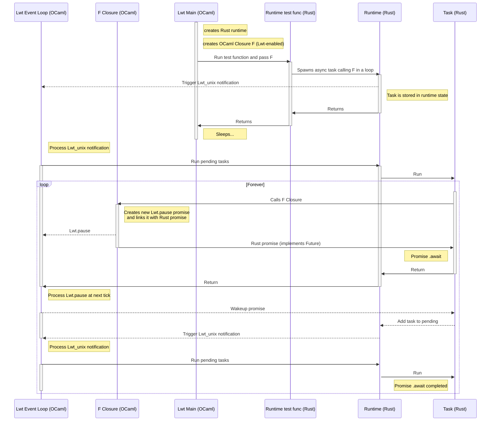

# OCaml Lwt Interop

**WARNING**: Highly experimental code, do not use in production!

This project tries to solve the problem of interop between asynchronous OCaml
(Lwt flavour) and asynchronous Rust.

## Architecture

### Thread-local Rust executor

Thread-local Rust executor is running on the same thread as OCaml and notifies Lwt
event loop that it has Rust async tasks to run via Lwt_unix notification
mechanism. Rust tasks can be woken up by other threads, so task queue in
thread-local executor is actually thread-safe, and so is Lwt_unix notifcation.

Callback that is registered to Lwt_unix notification instructs the thread-local executor to run all tasks that are currently ready to be run (i.e. the executor won't block the Lwt event loop waiting for more tasks to becore ready).

Lwt event loop and Rust thread-local executor cooperatively push their
futures/tasks/promises forward, making progress in the whole hybrid async
application. An example of such interaction is depicted in [test scenario
section](#test-scenario).

Thread-local executor can be found in
[src/local_executor.rs](src/local_executor.rs)

### Rust `Future` adapter for Lwt promises

Asynchronous tasks in Rust running cooperatively with Lwt event loop are nice,
but not quite practical if we can't wait for `'a Lwt.t` values inside those Rust
tasks.

To solve this problem, there is a `Promise` Rust type, that implements `Future`
trait, and thus can be awaited in Rust async tasks. OCaml side can create it,
return it to Rust, and then after some time asynchronously resolve or reject it
with some value. That value is stored in `Promise`, and next time some task
polls this `Promise`, it will get this value back (or `Promise` will wake up
corresponding `Waker` if some task polled before we've put some value inside).

## Test scenario

Test scenario can be found in `test/test.ml`. It passes Lwt-enabled callback
into Rust async task, that executes the callback, waits till it completes and
then loops over calling it again.

